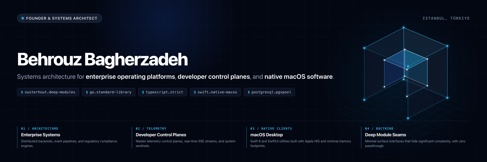

<div align="center">
  
</div>

<p align="center">
  <a href="https://achord.io"></a>
  <a href="https://behruzbagirzade.com"></a>
  <a href="https://linkedin.com/in/itisbehrouz"></a>
  <a href="https://x.com/itisbehrouz"></a>
  <a href="mailto:contact@achord.io"></a>
</p>

```text
$ achord sysinfo --architect itisbehrouz

  Identity           Behrouz Bagherzadeh (Behruz Bagirzade)
  Title              Founder & Systems Architect
  Organization       Achord Ltd (Achord Bilgi Teknolojileri Ltd. Şti.)
  Headquarters       Istanbul, Türkiye
  Architecture Core  John Ousterhout Deep Modules • Zero-Framework HTTP
  Active Runtimes    Go 1.24+ • TypeScript • Swift 6 • PostgreSQL • Lit 3
  Official Inbound   contact@achord.io
```

---

## Core Disciplines & Focus Areas

<table width="100%">
<tr>
<td width="50%" valign="top">
<h4>Enterprise Operating Architecture</h4>
<p>I design software systems that align business operations with technical architecture.</p>
<ul>
  <li>Distributed backends and event-driven workflows</li>
  <li>Enterprise compliance and business process engines</li>
  <li>High-performance data pipelines and system integrations</li>
</ul>
</td>
<td width="50%" valign="top">
<h4>Developer Telemetry & Control Planes</h4>
<p>I build tools that give engineering teams real-time operational clarity.</p>
<ul>
  <li>Master control planes, metrics pipelines, and process sentinels</li>
  <li>Real-time Server-Sent Events (SSE) and live streams</li>
  <li>Developer pair networks and automated engineering toolchains</li>
</ul>
</td>
</tr>
<tr>
<td width="50%" valign="top">
<h4>Native Apple Desktop Engineering</h4>
<p>I engineer native macOS applications that respect user attention and hardware resources.</p>
<ul>
  <li>Native Swift 6 and SwiftUI architectures</li>
  <li>Apple Human Interface Guidelines (HIG) compliance</li>
  <li>Zero-Webview overhead and minimal memory footprints</li>
</ul>
</td>
<td width="50%" valign="top">
<h4>Deep Module Engineering Doctrine</h4>
<p>I enforce clear interface boundaries that hide operational complexity.</p>
<ul>
  <li>Deep modules with minimal interface surface areas</li>
  <li>Zero-framework standard library HTTP handlers in Go</li>
  <li>Type-safe contracts with RFC 7807 problem details</li>
</ul>
</td>
</tr>
</table>

---

## Layered Architecture Model

```text
┌──────────────────────────────────────────────────────────────────────────────┐
│                           LAYER 1: INTERFACE SEAMS                           │
│  • Strict Type Contracts: TypeScript, Zod schemas, Go struct validations     │
│  • Unified Design Tokens: W3C DTCG standard, Tailwind scales, SwiftUI tokens │
│  • Standard Error Semantics: RFC 7807 Problem Details for HTTP APIs          │
├──────────────────────────────────────────────────────────────────────────────┤
│                           LAYER 2: DEEP DOMAIN MODULES                       │
│  • High Depth-to-Interface Ratio: Simple function signatures, deep logic     │
│  • Hidden Information: Internal state encapsulation, zero passthroughs       │
│  • Deterministic Business Logic: Idempotent operations, state machines       │
├──────────────────────────────────────────────────────────────────────────────┤
│                           LAYER 3: RUNTIMES & DATA STORES                    │
│  • Zero-Framework Go Handlers: Go 1.24+ standard library net/http            │
│  • Concurrency & Pooling: pgxpool for PostgreSQL, SQLite in WAL mode         │
│  • Event Distribution: Redis pub/sub, in-memory channels, SSE pipelines      │
└──────────────────────────────────────────────────────────────────────────────┘
```

### Engineering Tenets

1. **Architecture Before Technology:** Software tools change over time. Operating architecture remains stable.
2. **Deep Modules Over Shallow Wrappers:** Design interfaces with small surface areas that hide significant complexity.
3. **Systems Before Solutions:** Do not optimize isolated tools. Design the complete operating model.
4. **Operational Clarity:** Real-time visibility into systems, data, and performance is mandatory.

---

## Technical Stack & Tooling

<table width="100%">
<tr>
<td width="25%" valign="top"><strong>Languages</strong></td>
<td width="75%">
  
  
  
  
  
  
</td>
</tr>
<tr>
<td valign="top"><strong>Frontend & Web</strong></td>
<td>
  
  
  
  
  
  
</td>
</tr>
<tr>
<td valign="top"><strong>Backend & Systems</strong></td>
<td>
  
  
  
  
  
  
</td>
</tr>
<tr>
<td valign="top"><strong>Native & Desktop</strong></td>
<td>
  
  
  
</td>
</tr>
<tr>
<td valign="top"><strong>Standards & Protocols</strong></td>
<td>
  
  
  
  
</td>
</tr>
</table>

---

## Transformation Leadership & Track Record

Fifteen years of enterprise leadership support these architectural standards.

|    Metric     | Focus Area               | Operational Outcome                                                         |
| :-----------: | :----------------------- | :-------------------------------------------------------------------------- |
|    **80%**    | Report Automation        | Engineered unified data models across Finance, HR, Sales, and Supply Chain. |
|    **67%**    | Operational Efficiency   | Built automated workflow pipelines on enterprise low-code platforms.        |
|   **450+**    | Workforce Digitalization | Delivered unified digital workplace platforms across nine enterprise sites. |
| **18 → 6 mo** | Program Velocity         | Compressed delivery cycles with standardized modular architecture.          |

---

## Achord Ltd Official Channels

Follow official updates and releases from Achord:

- **Website:** [achord.io](https://achord.io)
- **GitHub Organization:** [github.com/achord-io](https://github.com/achord-io)
- **LinkedIn:** [linkedin.com/company/achord-io](https://www.linkedin.com/company/achord-io)
- **X (Twitter):** [@achord_io](https://x.com/achord_io)
- **Instagram:** [@achord.io](https://www.instagram.com/achord.io)
- **Facebook:** [facebook.com/achord.io](https://www.facebook.com/achord.io)

---

## Inbound & Direct Contact

I welcome technical discussions with founders, software architects, and systems engineers.

- **Founder Website:** [behruzbagirzade.com](https://behruzbagirzade.com)
- **LinkedIn:** [linkedin.com/in/itisbehrouz](https://linkedin.com/in/itisbehrouz)
- **X (Twitter):** [@itisbehrouz](https://x.com/itisbehrouz)
- **Official Inbound Email:** [contact@achord.io](mailto:contact@achord.io)

<br />

<div align="center">
  <sub>Achord Bilgi Teknolojileri ve Danışmanlık Ltd. Şti. • Istanbul, Türkiye</sub>
</div>
